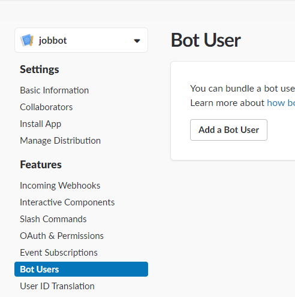
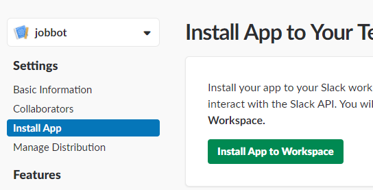

# Cookie Cutter Slackbot


1. Install cookiecutter
```
pip install cookiecutter
```

2. Generate a project
```
cookiecutter cookie-cutter-slackbot
```

3. Create [a slack app](https://api.slack.com/apps?new_app=1).

4. Create a bot user.



5. Install the app to your workspace.


